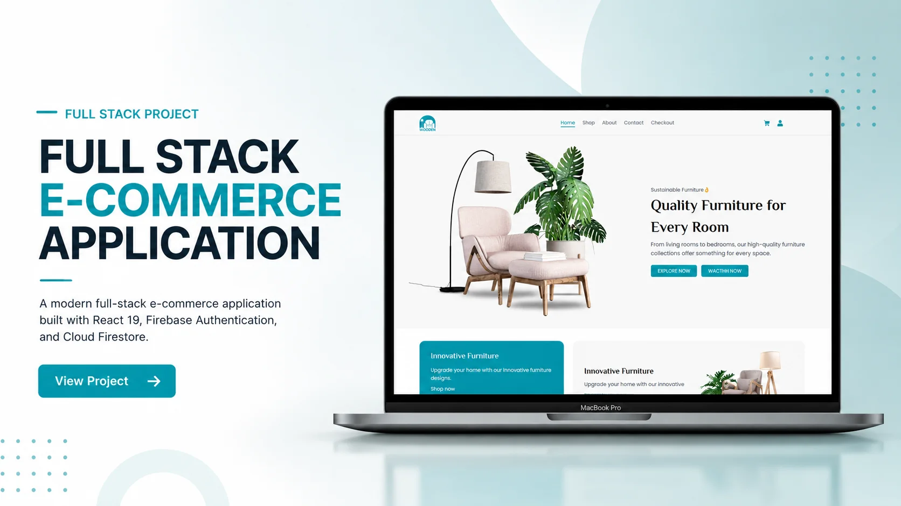

#  Wooden — Furniture E-Commerce

A modern full-stack furniture e-commerce web application built with **React**, **Firebase**, and **Tailwind CSS**. It provides a smooth shopping experience with secure authentication, real-time cart management, and a responsive user interface.


---

## Live Demo

**Live Preview:** https://alamin-wooden.vercel.app/

---

## Features

### Shopping

- Product Listing
- Product Search
- Category Filtering
- Brand Filtering
- Product Details
- Image Gallery
- Product Ratings
- Shopping Cart
- Quantity Management
- Checkout
- Shipping Address
- Order Placement

### Authentication

- Email & Password Authentication
- Google Authentication
- Private Route Protection

### User Dashboard

- Order History
- User Profile
- Order Management

### User Experience

- Responsive Design
- Fast Performance
- Toast Notifications
- Error Handling

---

## Tech Stack

| Frontend | Backend & Services |
|----------|--------------------|
| React 19 | Firebase Firestore |
| Vite | Firebase Authentication |
| Tailwind CSS | Firebase |
| React Router | |
| React Hot Toast | |

---

## Project Structure

```text
src/
├── assets/
├── components/
├── contexts/
├── hooks/
├── layout/
├── pages/
├── routes/
├── services/
└── utils/
```

---

## Getting Started

### Clone the Repository

```bash
git clone https://github.com/alamin-one/WOODEN.git
```

### Navigate to the Project

```bash
cd WOODEN
```

### Install Dependencies

```bash
npm install
```

### Setup Environment Variables

Create a `.env.local` file in the project root.

```env
VITE_API_KEY=
VITE_AUTH_DOMAIN=
VITE_PROJECT_ID=
VITE_STORAGE_BUCKET=
VITE_MESSAGING_SENDER_ID=
VITE_APP_ID=
```

### Run the Development Server

```bash
npm run dev
```

Open your browser and visit:

```text
http://localhost:5173
```

---

## Screenshot



---

## Repository

https://github.com/alamin-one/WOODEN

---

## Developed By

**Al-Amin**

GitHub: https://github.com/alamin-one

---

## License

This project is licensed under the **MIT License**.

---

## Support

If you found this project helpful, consider giving it a ⭐ on GitHub.
